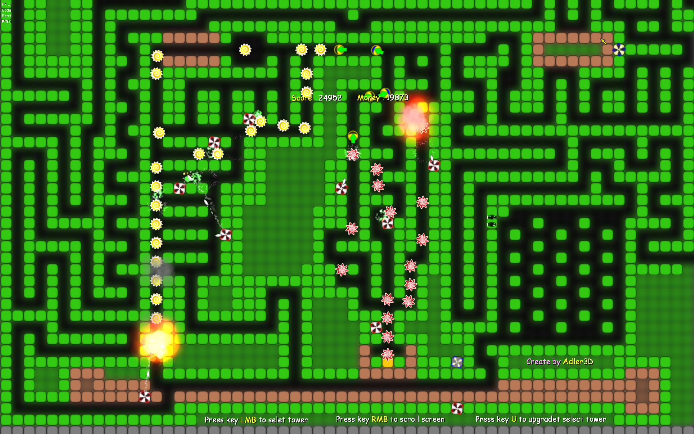

## DoNotEat
<pre>
РАЗРАБОТЧИКИ ПРОЕКТА: Adler3D - Программирование/Редактор/Дизайн/Баланс

ВРЕМЯ РАЗРАБОТКИ ПРОЕКТА: ~300 часов.

ИСПОЛЬЗОВАН ЛИ СТОРОННИЙ:
  - графический движок: нет
  - игровой движок: нет
  - графический контент: да
  - музыкальный контент: нет

СИСТЕМНЫЕ ТРЕБОВАНИЯ:
  - CPU: 1.8GHz
  - RAM: 512mb
  - VRAM: 128mb
  - Версия шейдеров: 1.0
  - Аппаратная поддержка GAPI: DirectX 9.0

НАЗНАЧЕНИЕ КЛАВИШ УПРАВЛЕНИЯ (клавиша/действие):
  - ЛКМ(Запустить волну;Остановить волну;Выбрать башню)
  - ПКМ(Двигать камеру)
        - U(улучшение выделеной башни)

ПРИМЕЧАНИЕ АВТОРА ПРОЕКТА: Сильно не пинать.

Как запустить волну?
  Жмите зелёную кнопку(это так, на которой написан вот такой текст - [*****])
  Жмите чёрную кнопку(это так, на которой написан вот такой текст - [*****])
Фичи:
  Игра непрерыва(Тоесть если вы её закроете, а потом запустите, то она продолжится с того же места)
</pre>